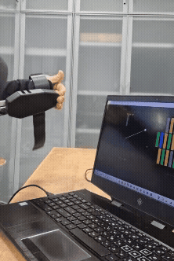
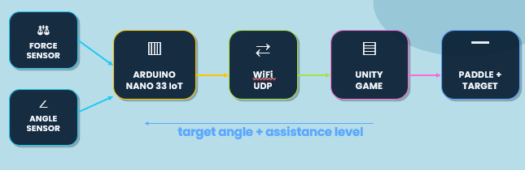
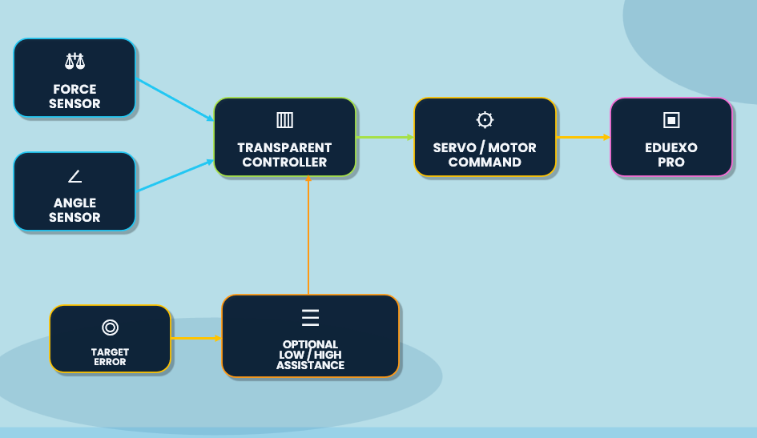
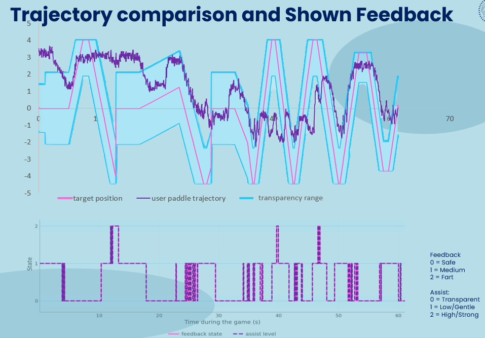
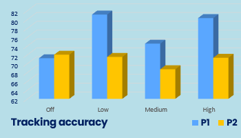
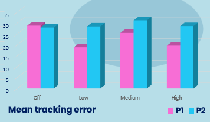
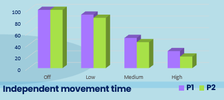

# EduExo Brick Breaker — Active Transparent Control & Assist-as-Needed Rehabilitation Exergame

**Human-in-the-loop rehabilitation-style platform integrating an EduExo Pro upper-limb exoskeleton with a Unity Brick Breaker exergame, active transparent control, adjustable assist-as-needed support, real-time visual feedback, and quantitative performance logging.**

> **Individual redevelopment:** Jessica Dichakdjian  
> **Course:** Collaborative Robotics — Politecnico di Milano  
> **Academic year:** 2025–2026  
> **Platform:** EduExo Pro + Arduino + Unity / C#



---

## At a Glance

| | |
|---|---|
| **Application** | Upper-limb rehabilitation-style exergame |
| **Robot** | EduExo Pro elbow exoskeleton |
| **Game engine** | Unity |
| **Unity language** | C# |
| **Embedded controller** | Arduino |
| **Human input** | Elbow flexion / extension |
| **Game control** | Arm motion controls vertical paddle position |
| **Control strategy** | Active transparent control + assist-as-needed |
| **Assistance levels** | Off, Low, Medium, High |
| **Feedback** | Green / orange / red tracking-error feedback |
| **Communication** | USB Serial in final evaluation |
| **Logging** | Automatic CSV trajectory and performance logging |
| **Evaluation** | 2 healthy users, repeated 60-second sessions |
| **Validation type** | Technical / engineering validation, not clinical validation |

---

# Project Overview

This project investigates **human-robot collaboration for upper-limb rehabilitation-style training** using an EduExo Pro exoskeleton connected to a Unity implementation of Brick Breaker.

The user's elbow movement controls the paddle:

```text
Human Elbow Motion
        ↓
EduExo Sensors
        ↓
Arduino Controller
        ↓
USB Serial
        ↓
Unity
        ↓
Brick Breaker Paddle
```

Rather than simply moving the user's arm toward the target continuously, the system implements an **assist-as-needed strategy**.

The user remains the primary source of movement while the robot provides additional support only when tracking error becomes sufficiently large.

---

# Project History & Individual Contribution

The project began as a group implementation in which the EduExo was connected to a Unity Brick Breaker game.

The original group work established the basic interaction:

```text
elbow movement → exoskeleton sensing → Unity paddle control
```

I later retook the project individually for the second-chance examination and substantially redesigned and extended the system.

The individual redevelopment focused on:

- active transparent control
- assist-as-needed behavior
- real-time visual tracking feedback
- four configurable assistance intensities
- Unity–Arduino communication
- timed rehabilitation-style sessions
- automatic experimental logging
- session performance summaries
- residual interaction-force evaluation
- repeated user testing
- quantitative trajectory and assistance analysis

The updated report explicitly distinguishes the original collaborative work from the later **individual redevelopment by Jessica Dichakdjian**.

---

# Why Brick Breaker?

Brick Breaker is compatible with the EduExo because the task can be controlled using one primary degree of freedom:

```text
Elbow flexion / extension
            ↓
Vertical paddle movement
```

The ball trajectory also creates a clear reference position for the paddle.

This makes the game suitable for implementing an error-based rehabilitation strategy:

```text
User Position
     +
Target Position
     ↓
Tracking Error
     ↓
Feedback / Assistance Decision
```

---

# System Architecture

The original implementation connected the EduExo sensors to Unity through the embedded controller.



For the final evaluation, USB Serial communication was used instead of the earlier WiFi/UDP implementation to improve communication reliability during repeated testing and data acquisition.

---

# Active Transparent Control

A major objective of the individual redevelopment was to correct the behavior of the original **no-assistance region**.

In the earlier implementation, transparency was approximated by detaching or disabling the motor.

That is not equivalent to transparent robotic interaction.

In the updated system, the actuator electronics remain active and the controller instead operates in a **high-compliance / admittance-inspired transparent mode**.

```text
User close to target
        ↓
Transparent mode
        ↓
Motor remains active
        ↓
High-compliance behavior
        ↓
User remains primary motion source
```

Motor power-down is retained for safety rather than being used as the normal transparent state.



---

# Assist-as-Needed Control

The Unity system evaluates the distance between:

```text
Expected / target paddle position
                and
Actual user-controlled paddle position
```

The normalized tracking error determines both visual feedback and optional physical support.

Three control states are used:

| State | Meaning | Robot behavior |
|---|---|---|
| **Transparent** | User sufficiently close to target | Minimal resistance / user-driven motion |
| **Gentle Assist** | Moderate tracking error | Low physical support |
| **Strong Assist** | Large tracking error | Higher physical support |

The corresponding Unity implementation is located in:

```text
unity/rehabilitation/BallReturnCheckpoint.cs
```

The controller assigns:

```text
Transparent = 0
Gentle      = 1
Strong      = 2
```

and sends the selected assistance state and target position to the Arduino controller.

---

# Adjustable Assistance Intensity

A second control layer allows the overall assistance behavior to be changed between:

```text
Off
Low
Medium
High
```

These settings modify when the system begins assisting the user.

### Off

Physical assistance is disabled.

The user still receives visual feedback, but movement remains independent.

### Low

A relatively large transparent region is maintained so the robot intervenes less frequently.

### Medium

Assistance begins earlier when tracking error increases.

### High

The transparent region is smaller and assistance activates earlier, providing more guidance.

This provides an important rehabilitation trade-off:

```text
More assistance
      ↓
More guidance
      ↓
Less independent movement


Less assistance
      ↓
More user autonomy
      ↓
Greater independent movement requirement
```

The assistance-level logic is implemented in:

```text
unity/rehabilitation/GameManager.cs
```

---

# Real-Time Visual Feedback

The updated Unity interface provides immediate visual feedback based on tracking error.

```text
GREEN  → Safe / transparent region
ORANGE → Moderate tracking error
RED    → Large tracking error
```

Visual feedback remains active even when physical assistance is disabled.

This allows the user to attempt self-correction before relying on robotic assistance.

[▶ Watch assist-as-needed and feedback demonstration](media/demos/assist_as_needed_feedback_demo.mp4)

---

# Ball / Target Reference

The system computes a target paddle position and compares it with the current user-controlled position.

The Unity logic supports ball-return prediction using raycasting and wall reflections.

The resulting target is used to calculate:

- paddle tracking error
- normalized tracking error
- transparent-region boundaries
- feedback state
- assistance state
- target command sent to the Arduino

The relevant implementation is:

```text
unity/rehabilitation/BallReturnCheckpoint.cs
```

---

# EduExo–Unity Communication

The final Unity implementation communicates with the Arduino through **USB Serial**.

The paddle controller receives information such as:

```text
current angle
target angle
assistance level
residual interaction-force proxy
servo command
raw angle sensor value
raw force sensor value
```

The main Unity communication layer is:

```text
unity/rehabilitation/PaddleScript.cs
```

The embedded controller is:

```text
arduino/BrickBreaker.ino
```

### Unity → Arduino

Unity sends:

```text
assistLevel,targetAngle
```

For example:

```text
0,50  → transparent mode
1,70  → gentle assistance
2,30  → strong assistance
```

### Arduino → Unity

The Arduino sends telemetry containing:

```text
currentAngle,
targetAngle,
assistLevel,
residualTorquePercent,
servoCommand,
rawAngle,
forceRaw
```

---

# Arduino Control

The Arduino controller reads:

- elbow angle sensor
- interaction-force sensor
- commands received from Unity

and generates the actuator command.

The control logic distinguishes between:

```text
Transparent Control
        and
Assist Control
```

## Transparent Mode

The transparent controller uses force feedback with an admittance-inspired compliance strategy.

Its objective is to allow the user to move the exoskeleton with limited perceived resistance while maintaining active actuator control.

## Assistance Mode

When Unity requests assistance, the controller generates support toward the requested target.

Two support levels are available:

```text
Low Assist
High Assist
```

---

# Physical Human-in-the-Loop Demonstration

The system was tested with the physical EduExo while controlling the Unity game in real time.

[▶ Watch the EduExo–Unity physical control demonstration](media/demos/eduexo_arm_control_demo.mp4)

Additional gameplay:

[▶ Watch Brick Breaker gameplay](media/demos/brick_breaker_gameplay.mp4)

---

# Timed Rehabilitation-Style Sessions

The original game-over-based interaction was extended into a timed evaluation protocol.

Each experimental session lasts:

```text
60 seconds
```

A rehabilitation session continues to generate useful data even if the user loses the Brick Breaker game before the timer expires.

At the end of the session, the system generates performance information including:

- tracking accuracy
- mean tracking error
- maximum tracking error
- percentage of time in transparent mode
- gentle-assistance use
- strong-assistance use
- number of assistance activations

---

# Automatic Performance Logging

A dedicated logger was implemented in:

```text
unity/rehabilitation/ExoPerformanceLogger.cs
```

Each session automatically creates CSV files containing variables such as:

```text
time
game index
paddle position
ball position
target position
tracking error
normalized tracking error
transparent-region limits
feedback state
assistance level
residual interaction-force proxy
servo command
arm angle
target angle
remaining lives
collision count
```

A separate summary file is also produced for each session.

This converts the exergame from a simple interactive demo into a platform that can be quantitatively evaluated after each run.

---

# Experimental Evaluation

The updated system was evaluated with:

```text
Participants:       2 healthy users
Session duration:   60 s
Conditions:         Off / Low / Medium / High
```

To reduce ordering effects, the two users tested the assistance settings in opposite sequences.

The experiments investigated:

- target tracking
- assistance-state behavior
- independent movement
- interaction-force proxy
- real-time feedback
- assistance activations
- user performance across assistance settings

This was a **technical validation with healthy participants**, not a clinical trial.

---

# Trajectory & Feedback Evaluation

A representative logged session compares:

- target position
- actual paddle trajectory
- transparent region
- feedback state
- physical-assistance state



This verifies that the feedback and assistance state changed as the user's tracking error changed.

---

# Experimental Results

The evaluation demonstrated that changing the assistance-intensity setting changed when and how often the robot intervened.

The clearest result was the expected autonomy–assistance trade-off:

```text
Higher assistance
      ↓
Earlier / more frequent intervention
      ↓
Lower percentage of independent movement


Lower assistance
      ↓
Larger transparent region
      ↓
More independent user movement
```

## Tracking Accuracy



Tracking accuracy did not improve monotonically with increasing assistance.

This is expected in a human-in-the-loop system because performance also depends on:

- reaction time
- individual strategy
- adaptation to the exoskeleton
- familiarity with the task

---

## Mean Tracking Error



The results indicate that simply maximizing assistance does not necessarily minimize tracking error for every participant.

This supports the use of adjustable or patient-specific assistance rather than a fixed maximum-support strategy.

---

## Independent Movement Time



Independent movement showed the clearest trend.

As assistance intensity increased, users spent less time inside the transparent region because the system intervened earlier.

This illustrates the central assist-as-needed objective:

> provide support when required without unnecessarily replacing the user's own effort.

---

# Residual Interaction-Force Proxy

The EduExo setup does not directly measure biomechanical elbow joint torque.

Instead, force-sensor deviation from the calibrated rest value is used as a **residual interaction-force / torque proxy**.

It is therefore used comparatively to evaluate how transparent the exoskeleton feels during user-driven movement.

It should **not** be interpreted as an exact biomechanical joint-torque measurement.

The analysis focuses primarily on transparent mode, where low average residual values indicate limited resistance to user motion.

---

# Safety

The system maintains separate concepts for:

```text
Transparent interaction
        ≠
Emergency motor shutdown
```

Transparent mode keeps the controller active.

Physical power controls and motor power-down remain available as safety mechanisms.

Additional constraints include:

- calibrated arm range
- limited actuator commands
- controlled assistance levels
- bounded paddle mapping

---

# Key Individual Software

The core individual redevelopment is contained in:

```text
unity/rehabilitation/
├── BallReturnCheckpoint.cs
├── ExoPerformanceLogger.cs
├── GameManager.cs
└── PaddleScript.cs
```

### `BallReturnCheckpoint.cs`

Implements:

- target / ball reference
- tracking-error calculation
- transparent-region logic
- feedback classification
- gentle / strong assistance selection
- command transmission to Arduino

### `PaddleScript.cs`

Implements:

- USB Serial communication
- Arduino telemetry parsing
- arm-angle calibration
- physical arm → Unity paddle mapping
- connection monitoring
- assistance command interface
- residual-force data handling

### `GameManager.cs`

Implements:

- 60-second rehabilitation sessions
- assistance-intensity selection
- performance tracking
- end-session evaluation
- integration with Brick Breaker game state

### `ExoPerformanceLogger.cs`

Implements:

- automatic CSV logging
- trajectory recording
- tracking-error recording
- assistance-state recording
- residual interaction-force logging
- session-summary generation

---

# Gameplay Layer

Supporting Brick Breaker scripts are kept separately:

```text
unity/gameplay/
├── BallScript.cs
├── BalltwoScript.cs
├── BiggerPaddleScript.cs
├── BrickScript.cs
├── LifeScript.cs
├── MultiBallScript.cs
├── PauseScript.cs
├── SaveID.cs
└── feedback.cs
```

These scripts implement the underlying game mechanics, while the `rehabilitation/` directory contains the main human-robot interaction extensions.

---

# Development / Test Code

Earlier development code is retained separately:

```text
unity/tests/
└── PaddleTest.cs
```

This documents the intermediate testing of:

- serial communication
- Arduino-controlled paddle motion
- keyboard fallback
- mapping and calibration
- early assistance behavior

---

# Repository Structure

```text
eduexo-brick-breaker-rehabilitation/
│
├── README.md
├── .gitignore
│
├── arduino/
│   └── BrickBreaker.ino
│
├── unity/
│   ├── rehabilitation/
│   │   ├── BallReturnCheckpoint.cs
│   │   ├── ExoPerformanceLogger.cs
│   │   ├── GameManager.cs
│   │   └── PaddleScript.cs
│   │
│   ├── gameplay/
│   │   ├── BallScript.cs
│   │   ├── BalltwoScript.cs
│   │   ├── BiggerPaddleScript.cs
│   │   ├── BrickScript.cs
│   │   ├── LifeScript.cs
│   │   ├── MultiBallScript.cs
│   │   ├── PauseScript.cs
│   │   ├── SaveID.cs
│   │   └── feedback.cs
│   │
│   └── tests/
│       └── PaddleTest.cs
│
├── media/
│   ├── demos/
│   │   ├── eduexo_unity_control.gif
│   │   ├── eduexo_arm_control_demo.mp4
│   │   ├── assist_as_needed_feedback_demo.mp4
│   │   └── brick_breaker_gameplay.mp4
│   │
│   └── images/
│       ├── system_architecture.png
│       ├── transparent_control_architecture.png
│       ├── trajectory_feedback_example.png
│       ├── tracking_accuracy.png
│       ├── mean_tracking_error.png
│       └── independent_movement_time.png
│
└── docs/
    ├── Updated_Project_Report_BRICK_BREAKER_Jessica_Dichakdjian.pdf
    └── BrickBreaker_Collaborative_Jessica_Dichakdjian.pptx
```

---

# Documentation

The repository includes the complete updated project report:

[📄 Updated Individual Project Report](docs/Updated_Project_Report_BRICK_BREAKER_Jessica_Dichakdjian.pdf)

and the project presentation:

[📊 Project Presentation](docs/BrickBreaker_Collaborative_Jessica_Dichakdjian.pptx)

---

# Limitations

The current implementation has several important limitations:

- evaluation involved only two healthy users
- the experiments constitute engineering validation rather than clinical validation
- residual interaction torque is estimated indirectly from force-sensor measurements
- exoskeleton transparency remains sensitive to mechanical alignment and controller tuning
- assistance thresholds are manually selected rather than automatically personalized
- final experiments used wired USB communication rather than optimized wireless communication
- longer-term user adaptation was not evaluated

---

# Future Work

Potential extensions include:

- patient-specific assistance thresholds
- automatic assistance adaptation based on performance
- improved force-to-joint-torque estimation
- individualized movement-range calibration
- further transparency tuning
- smoother assistance transitions
- improved session-summary UI
- wireless communication reintroduction after validation
- longer-duration studies
- evaluation with users with neuromotor impairments

A longer-term adaptive strategy could use performance metrics such as:

```text
tracking accuracy
mean tracking error
time in transparent mode
assistance frequency
```

to automatically increase or decrease support as the user's performance changes.

---

# Skills Demonstrated

This project demonstrates experience in:

- rehabilitation robotics
- human-robot interaction
- collaborative robotics
- exoskeleton control
- assist-as-needed control
- transparent robotic interaction
- admittance-inspired control
- embedded control
- Arduino
- Unity
- C#
- serial communication
- sensor integration
- real-time feedback
- human-in-the-loop systems
- experimental robotics
- performance logging
- CSV data acquisition
- robotic system integration
- technical validation

---

# Attribution

The original EduExo–Brick Breaker prototype was developed as a group project by:

- Alberto Caramanna
- Jessica Dichakdjian
- Daniela Macaya
- Rebecca Papa
- Mateo Zeneli

The **updated second-chance implementation documented in this repository was developed individually by Jessica Dichakdjian**.

The individual work transformed the baseline game–exoskeleton interaction into a more complete rehabilitation-style evaluation platform with active transparent control, configurable assist-as-needed support, real-time feedback, automatic logging, and quantitative experimental evaluation.

---

# Project Status

✅ **Completed individual redevelopment and technical validation**

The final implementation demonstrated:

- physical EduExo control of the Unity game
- active transparent interaction without normal motor detachment
- real-time error-based visual feedback
- adjustable assist-as-needed support
- four assistance-intensity settings
- USB Unity–Arduino communication
- automatic performance logging
- timed rehabilitation-style sessions
- quantitative two-user technical evaluation
